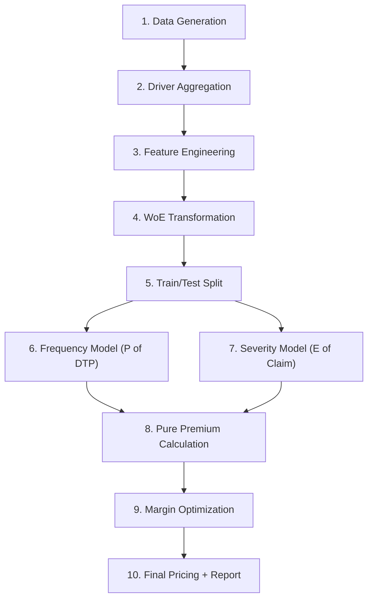

# 🏢 Оптимизация убыточности полисов ОГПО — Pipeline Overview

## Архитектура проекта

```
freedom/
├── config.py                  # Конфигурация: бизнес-правила, гиперпараметры
├── data_preparation.py        # Генерация данных, FE, WoE
├── modeling.py                # Frequency-Severity модели
├── pricing_optimization.py    # Ценообразование и оптимизация LR
├── visualization.py           # Графики и визуализация
├── main.py                    # Оркестрация pipeline
└── requirements.txt           # Зависимости
```

## Pipeline Flow



## Результаты запуска

| Метрика | Значение |
|---------|----------|
| Baseline Loss Ratio | 35.17% |
| Целевой LR | 70% |
| Frequency ROC-AUC (test) | 0.5073 |
| Frequency GINI (test) | 0.0146 |
| Severity RMSE | 325,677 ₸ |
| Лучший margin (grid) | 0.5101 |
| Лучший margin (scipy) | 0.9717 |
| Двухфакторные маржи | G1=1.39, G2=0.80 |

> [!NOTE]
> Низкий GINI на тесте — это ожидаемо для **синтетических** данных и **sklearn fallback** (без LightGBM). На реальных данных с LightGBM + proper feature engineering GINI обычно 30–50%.

## Модули

### [config.py](file:///Users/madina/projects/freedom/config.py)
- Авто-определение бэкенда (LightGBM → sklearn fallback)
- Бизнес-правила: target LR 70%, клиппинг цен 0x–3x
- Гиперпараметры для обоих бэкендов

### [data_preparation.py](file:///Users/madina/projects/freedom/data_preparation.py)
- Генерация 50K полисов + 80K связей полис-водитель
- Агрегация: min/max/mean возраст, стаж, кол-во водителей
- Feature Engineering: бакеты, interactions, frequency encoding
- **WoE трансформация** с Лапласовым сглаживанием + IV-отчёт

### [modeling.py](file:///Users/madina/projects/freedom/modeling.py)
- **FrequencyModel**: Binary classification (P(ДТП)), is_unbalance / scale_pos_weight
- **SeverityModel**: Tweedie regression (E[Claim]), обучается только на claims
- **Pure Premium** = P(ДТП) × E[Severity]
- Метрики: ROC-AUC, GINI, RMSE, MAE

### [pricing_optimization.py](file:///Users/madina/projects/freedom/pricing_optimization.py)
- `compute_new_premium()`: new_price = pure_premium / target_LR × margin, с клиппингом
- Разделение на Группу 1 (↓/=) и Группу 2 (↑)
- **Grid Search** по маржинальному коэффициенту (200 точек)
- **SciPy Brent** оптимизация (точное решение)
- **Двухфакторная оптимизация** (раздельные маржи для групп)
- Полный финальный отчёт с квантильным анализом

### [visualization.py](file:///Users/madina/projects/freedom/visualization.py)
- LR comparison bar chart
- Price change distribution + boxplot по группам
- Optimization landscape plot
- Pure Premium vs Old Premium scatter

## Как запустить

```bash
# Установить зависимости (рекомендуется с lightgbm)
pip install -r requirements.txt

# Запуск полного pipeline
python main.py

# Включить визуализацию: в main.py поставить ENABLE_PLOTS = True
```

> [!IMPORTANT]
> Для production: установите `lightgbm` — код автоматически переключится на него. С LightGBM доступны Tweedie loss для severity и early stopping.
